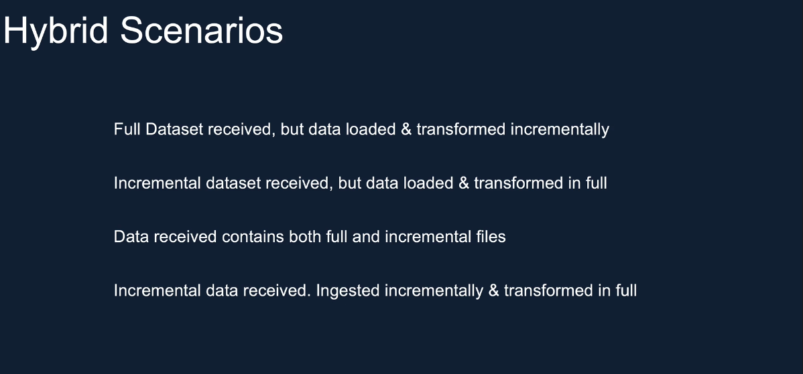
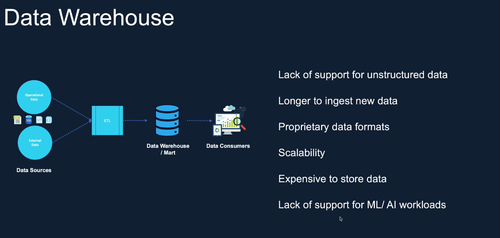
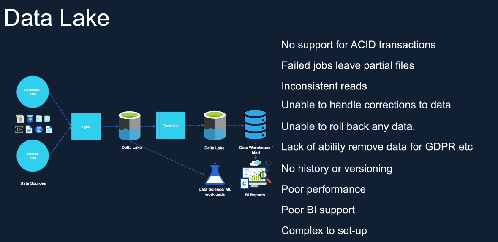
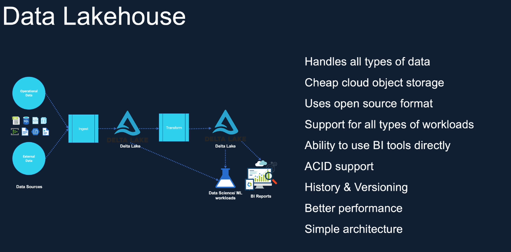
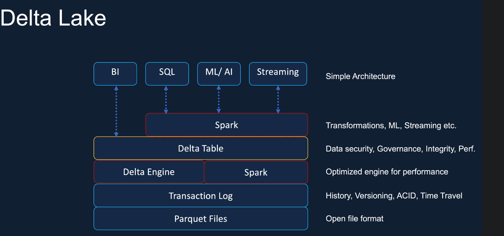
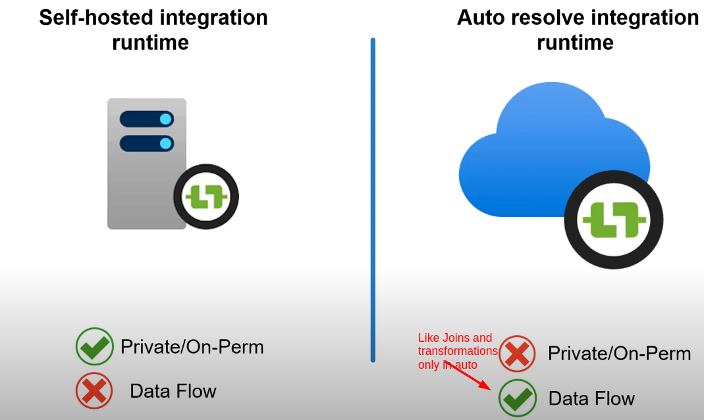

we can create different user from Microsoft Enter ID and then assign role from ADLG2 storage IAM role.

Microsoft Enter ID -> app registration -> client_id and tenant_id from here

certifcate and secreate -> secreat_id -  value - secreat value

https://zecdatastorage.blob.core.windows.net/demo/employees.csv

in storage give permission to storage data contributor role

dbutils.fs.ls("abfss://demo@zecdatastorage.dfs.core.windows.net")

create - key -vault 
then i am role - assign role - Key Vault Administrator - to account user
then go to objects -> secrets then create - secrets

Connect to Azure Data Lake Storage Gen2 using service principle - key valut , scope
https://learn.microsoft.com/en-us/azure/databricks/connect/storage/tutorial-azure-storage

https://adb-1484081490052509.9.azuredatabricks.net/?o=1484081490052509#secrets/createScope

all workspace
properties of key -vault  - Vault URI,   resource id

using mount - 

1. to avoid long abfss urls - we can use file system symantics urls
2. every time we have to use credentials to authenticate before accessing the data from storage location to avoid this we use mounts

https://learn.microsoft.com/en-us/azure/databricks/connect/unity-catalog/cloud-storage/storage-credentials

# Benifits of Databricks mount

1.databricks allow us to mount this storage account to dbfs, we specify the credentials once this storage is mounted, once it is mounted everyone who has access to the workspace can access the data without providing the credentials
2.they can use file system symantics urls 

dbfs is just an abstraction layer

Benifits of Databricks mount
1. Acces data without requiring credentials
2. Access files using file semantics rather than storage URLs (eg. /mnt/storage1)
3. Stores files to object storage (eg. azure blob), so you get all the Benifits from azure 

unity catalog for mutiple dataricks workspace

abfss://demo@zecdatastorage.dfs.core.windows.net
abfss://raw@zecdatastorage.dfs.core.windows.net/

Access Connector for Azure Databricks

create access connector - and give mermission to storage  account - storage blob contributor role
unity-catalog-access-connector

###########################################################

# Incrementally load data from a source data store to a destination data store

1. Install Azure PowerShell on Linux 
https://learn.microsoft.com/en-us/powershell/azure/install-azps-linux?view=azps-13.0.0

https://learn.microsoft.com/en-us/azure/data-factory/tutorial-incremental-copy-change-tracking-feature-powershell

zec@zec-HP-EliteBook-840-G3:~$ pwsh
PowerShell 7.4.6
PS /home/zec> Install-Module -Name Az -Repository PSGallery -Force
PS /home/zec> Update-Module -Name Az -Force                                                                             
PS /home/zec> Connect-AzAccount                                                                                         
Please select the account you want to login with.                                                                       

Retrieving subscriptions for the selection...

[Announcements]
With the new Azure PowerShell login experience, you can select the subscription you want to use more easily. Learn more about it and its configuration at https://go.microsoft.com/fwlink/?linkid=2271909.

If you encounter any problem, please open an issue at: https://aka.ms/azpsissue

Subscription name Tenant
----------------- ------
Pay-As-You-Go     Default Directory

PS /home/zec> 

2. Create an Azure storage account
https://learn.microsoft.com/en-us/azure/storage/common/storage-account-create?tabs=azure-portal

3. Create a single database - Azure SQL Database
https://learn.microsoft.com/en-us/azure/azure-sql/database/single-database-create-quickstart?view=azuresql&tabs=azure-portal

https://portal.azure.com/#create/Microsoft.AzureSQL

username - azureuser
password - Vajay8679@

SELECT name 
FROM sys.databases;

SELECT name 
FROM sys.schemas;

----------------------------

create table data_source_table
(
    PersonID int NOT NULL,
    Name varchar(255),
    Age int
    PRIMARY KEY (PersonID)
);

INSERT INTO data_source_table
    (PersonID, Name, Age)
VALUES
    (1, 'aaaa', 21),
    (2, 'bbbb', 24),
    (3, 'cccc', 20),
    (4, 'dddd', 26),
    (5, 'eeee', 22);

SELECT TOP (1000) * FROM [dbo].[data_source_table]

4. Enable Change Tracking mechanism on your database and the source table (data_source_table) by running the following SQL query:

ALTER DATABASE mySampleDatabase
SET CHANGE_TRACKING = ON  
(CHANGE_RETENTION = 2 DAYS, AUTO_CLEANUP = ON)  

ALTER TABLE data_source_table
ENABLE CHANGE_TRACKING  
WITH (TRACK_COLUMNS_UPDATED = ON)

5. Create a new table and store the ChangeTracking_version with a default value by running the following query:

create table table_store_ChangeTracking_version
(
    TableName varchar(255),
    SYS_CHANGE_VERSION BIGINT,
);

DECLARE @ChangeTracking_version BIGINT
SET @ChangeTracking_version = CHANGE_TRACKING_CURRENT_VERSION();  

INSERT INTO table_store_ChangeTracking_version
VALUES ('data_source_table', @ChangeTracking_version)

6. Run the following query to create a stored procedure in your database. The pipeline invokes this stored procedure to update the change tracking version in the table you created in the previous step.

CREATE PROCEDURE Update_ChangeTracking_Version @CurrentTrackingVersion BIGINT, @TableName varchar(50)
AS

BEGIN

UPDATE table_store_ChangeTracking_version
SET [SYS_CHANGE_VERSION] = @CurrentTrackingVersion
WHERE [TableName] = @TableName

END

7. Create a data factory with powershell

$resourceGroupName = "ADFTutorialResourceGroup";

to chek location - Get-AzLocation | Select-Object Location, DisplayName

$location = "Central India"

- To create the Azure resource group, run the following command: -> 
New-AzResourceGroup $resourceGroupName $location

- datafactory name->
PS /home/zec> $dataFactoryName = "ZecDataCopyChgTrackingDF";  

- To create the data factory, run the following Set-AzDataFactoryV2 cmdlet:
PS /home/zec> Set-AzDataFactoryV2 -ResourceGroupName $resourceGroupName -Location $location -Name $dataFactoryName

8. Create Azure Storage linked service

Create a JSON file named AzureStorageLinkedService.json in C:\ADFTutorials\IncCopyChangeTrackingTutorial folder with the following content: (Create the folder if it does not already exist.). Replace <accountName>, <accountKey> with name and key of your Azure storage account before saving the file.

9. In Azure PowerShell, switch to the C:\ADFTutorials\IncCopyChangeTrackingTutorial folder.

10. Create Azure Storage linked service

Run the Set-AzDataFactoryV2LinkedService cmdlet to create the linked service: AzureStorageLinkedService. In the following example, you pass values for the ResourceGroupName and DataFactoryName parameters.

Set-AzDataFactoryV2LinkedService -DataFactoryName $dataFactoryName -ResourceGroupName $resourceGroupName -Name "AzureStorageLinkedService" -File ".\AzureStorageLinkedService.json"

Set-AzDataFactoryV2LinkedService -DataFactoryName "ZecDataCopyChgTrackingDF" -ResourceGroupName "ADFTutorialResourceGroup" -Name "AzureStorageLinkedService" -File ".\AzureStorageLinkedService.json"

11. Create Azure SQL Database linked service.

Create a JSON file named AzureSQLDatabaseLinkedService.json in C:\ADFTutorials\IncCopyChangeTrackingTutorial folder with the following content: Replace <your-server-name> and <your-database-name> with the name of your server and database before you save the file. You must also configure your Azure SQL Server to grant access to your data factory's managed identity.

before below process go to azue sql -> mysqlserverajay -> setting -> microsoft entra id -> set admin -> select user and selcect and save

Set-AzDataFactoryV2LinkedService -DataFactoryName $dataFactoryName -ResourceGroupName $resourceGroupName -Name "AzureSQLDatabaseLinkedService" -File ".\AzureSQLDatabaseLinkedService.json"

Set-AzDataFactoryV2LinkedService -DataFactoryName "ZecDataCopyChgTrackingDF" -ResourceGroupName "ADFTutorialResourceGroup" -Name "AzureSQLDatabaseLinkedService" -File ".\AzureSQLDatabaseLinkedService.json"

12. Create a source dataset

Create a JSON file named SourceDataset.json in the same folder with the following content:

Set-AzDataFactoryV2Dataset -DataFactoryName $dataFactoryName -ResourceGroupName $resourceGroupName -Name "SourceDataset" -File ".\SourceDataset.json"

Set-AzDataFactoryV2Dataset -DataFactoryName "ZecDataCopyChgTrackingDF" -ResourceGroupName "ADFTutorialResourceGroup" -Name "SourceDataset" -File ".\SourceDataset.json"

13. Create a sink dataset

Create a JSON file named SinkDataset.json in the same folder with the following content:

Set-AzDataFactoryV2Dataset -DataFactoryName $dataFactoryName -ResourceGroupName $resourceGroupName -Name "SinkDataset" -File ".\SinkDataset.json"

Set-AzDataFactoryV2Dataset -DataFactoryName "ZecDataCopyChgTrackingDF" -ResourceGroupName "ADFTutorialResourceGroup" -Name "SinkDataset" -File ".\SinkDataset.json"

14. Create a change tracking dataset

Create a JSON file named ChangeTrackingDataset.json in the same folder with the following content:

Set-AzDataFactoryV2Dataset -DataFactoryName $dataFactoryName -ResourceGroupName $resourceGroupName -Name "ChangeTrackingDataset" -File ".\ChangeTrackingDataset.json"

Set-AzDataFactoryV2Dataset -DataFactoryName "ZecDataCopyChgTrackingDF" -ResourceGroupName "ADFTutorialResourceGroup" -Name "ChangeTrackingDataset" -File ".\ChangeTrackingDataset.json"

15. Create a pipeline for the full copy

Create a JSON file: FullCopyPipeline.json in same folder with the following content:

Set-AzDataFactoryV2Pipeline -DataFactoryName $dataFactoryName -ResourceGroupName $resourceGroupName -Name "FullCopyPipeline" -File ".\FullCopyPipeline.json"

Set-AzDataFactoryV2Pipeline -DataFactoryName "ZecDataCopyChgTrackingDF" -ResourceGroupName "ADFTutorialResourceGroup" -Name "FullCopyPipeline" -File ".\FullCopyPipeline.json"

16. Run the full copy pipeline

we have to add IP - azure sql ->security -> networking -> Firewall rules

Invoke-AzDataFactoryV2Pipeline -PipelineName "FullCopyPipeline" -ResourceGroup $resourceGroupName -dataFactoryName $dataFactoryName

Invoke-AzDataFactoryV2Pipeline -PipelineName "FullCopyPipeline" -ResourceGroup "ADFTutorialResourceGroup" -dataFactoryName "ZecDataCopyChgTrackingDF"

if getting error while checking adf monitor pipeline run

inlinked service 
AzureSQLDatabaseLinkedService use username and password

17. Review the results

18. Add more data to the source table

INSERT INTO data_source_table
(PersonID, Name, Age)
VALUES
(6, 'new','50');

UPDATE data_source_table
SET [Age] = '10', [name]='update' where [PersonID] = 1

19. Create a pipeline for the delta copy

Create a JSON file: IncrementalCopyPipeline.json in same folder with the following content:

Set-AzDataFactoryV2Pipeline -DataFactoryName $dataFactoryName -ResourceGroupName $resourceGroupName -Name "IncrementalCopyPipeline" -File ".\IncrementalCopyPipeline.json"

Set-AzDataFactoryV2Pipeline -DataFactoryName "ZecDataCopyChgTrackingDF" -ResourceGroupName "ADFTutorialResourceGroup" -Name "IncrementalCopyPipeline" -File ".\IncrementalCopyPipeline.json"

20. Run the incremental copy pipeline

we have to add IP - azure sql ->security -> networking -> Firewall rules

this will run only when you go to azure sql ->security -> networking -> enabled (checked) allow azure services and resources to access this server.

Invoke-AzDataFactoryV2Pipeline -PipelineName "IncrementalCopyPipeline" -ResourceGroup $resourceGroupName -dataFactoryName $dataFactoryName

Invoke-AzDataFactoryV2Pipeline -PipelineName "IncrementalCopyPipeline" -ResourceGroup "ADFTutorialResourceGroup" -dataFactoryName "ZecDataCopyChgTrackingDF"

https://docs.delta.io/latest/index.html

update & delete in delta lake

https://docs.delta.io/latest/delta-update.html

merge in delta table

----------------------------------------------------

# ingest data from on-premsies to adlg2 using adf

sudo apt update
sudo apt install samba -y
sudo systemctl enable --now smbd
sudo systemctl status smbd

zec@zec-HP-EliteBook-840-G3:~$ pwd
/home/zec
zec@zec-HP-EliteBook-840-G3:~$ mkdir ingest_data
zec@zec-HP-EliteBook-840-G3:~$ ls -l
sudo smbpasswd -a zec
sudo nano /etc/samba/smb.conf

[ingest_data]

path = /home/zec/ingest_data
read only = no
valid users = zec,ajay

sudo docker run -d --name=adf_ir \
-e "ADFIR_KEY=IR@7c531179-c770-422d-ace9-5f83c285d86a@Zecdata-Df@ServiceEndpoint=zecdata-df.centralindia.datafactory.azure.net@UfW/yibGKGpHpr8JxtTrm7l80aWoLf9RzPiuuGAjC6I=" \
-e "ADFIR_LOGDIR=/tmp/irlogs" \
-v /tmp/irlogs:/tmp/irlogs \
mcr.microsoft.com/datafactory/selfhosted-integrationruntime:latest

------------------------------------------------

# ingest data from on-premsies to adlg2 using adf

1. create integration runtime 
    1. Azure, self-hosted - perform data flow,data movement and dispatch activities to external compute 
        1.1 Azure -> Use this for running data flows, data movement, external and pipeline activities in a fully managed, serverless compute in Azure.
        1.2 Self-Hosted -> Use this for running data movement, external and pipeline activities in an on-premises / private network by installing the integration runtime. 

        Note: Data flows are only supported on Azure integration runtime. You can use self-hosted integration runtime to stage the data on cloud storage and then use data flows to transform it. 

        we have to install integration runtime -> and paste key inside it 

    2. Azure SSIS - Lift-and-shift existing SSIS packages to execute in azure

    
    

2. Create Linked Services inside azure data factory - Manage
   Snowflake1 - 
            select data source -> snowflake
            attached integration runtime
            account='jhpmgzi-xt72971',
            database='TEST_DB',
            warehouse='COMPUTE_WH',
            user='Vajay8679',
            password='Vajay8679@',
            Role='ACCOUNTADMIN'
            HOST - https://jhpmgzi-xt7271.snowflakecomputing.com

    AzureBlobStorage2 -
            select data source -> azureblobstoarge
            attached integration runtime
            authentication type - SAS URI 
            SAS URL - SAS url - https://zecdatastorage.blob.core.windows.net/
            SAS Token - token
            Test connection - to linked service 

3. Inside Author create Pipelines 
        Inside activities -> Move and transform -> copy data
        source ->select new dataset -> snowflake
            import schema -> from connection/store
        Sink -> Azure Blob Storage
                select format - json/parquet
                linked service 
                import schema -> from connection/store
        setting -> enable staging
                    stageibg account linked service - AzureBlobStorage2    

